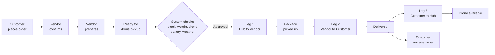

<div align="center">


# AeroDrop

### A Campus Drone Delivery System for UCLM


*Order from campus vendors and have it flown to your drop zone.*

</div>

---

## About

**AeroDrop** is a capstone project by Bachelor of Science in Information Technology students of the **University of Cebu Lapu-Lapu and Mandaue**. It is a campus marketplace and drone delivery application for ordering and delivering small items within the university.

The system connects campus users with approved vendors. Users browse products, place orders, track the drone on a live map, and review what they received. Vendors manage products, inventory, and orders. Administrators oversee accounts, drones, deliveries, weather, and analytics.

> [!NOTE]
> Drone flight and telemetry are **simulated**. Online payments run through the **Xendit sandbox** (no real money). Weather, campus coordinates, authentication, reviews, and all stored records are **real**.

---

## Highlights

| | |
|---|---|
| **Live campus weather** | Real conditions polled every 15 minutes, mapped to drone operating limits |
| **Interactive map tracking** | OpenStreetMap tiles with real campus coordinates and live drone position |
| **Physics-aware flight** | Flight time from real distance; payload affects speed and battery |
| **Verified accounts** | Email one-time codes, plus Google sign-in for customers |
| **Real payment gateway** | GCash and card through Xendit in sandbox mode, confirmed by webhook |
| **Transparent fees** | Distance and weight based, with a full breakdown before you pay |
| **Reviews and ratings** | Store and product ratings from verified deliveries |
| **Analytics export** | Admin reports exportable to CSV and PDF |

---

## Account Types

<table>
<tr>
<td width="33%" valign="top">

### User
Students, faculty, and staff who browse products and place delivery orders.

</td>
<td width="33%" valign="top">

### Vendor
Approved campus stores that manage products, inventory, and incoming orders.

</td>
<td width="33%" valign="top">

### Admin
Staff who manage accounts, drones, deliveries, weather, and reports.

</td>
</tr>
</table>

---

## Authentication

| Method | Who | Verification |
|---|---|---|
| **Email and password** | Users, Vendors, Admins | One-time code sent by email at registration and at each login |
| **Continue with Google** | Customers | None required — Google already verified the address |

Vendors register through the full application form because store details are needed, though approved vendors may then sign in with Google. Administrators cannot use Google sign-in. Password reset also uses emailed one-time codes.

> [!IMPORTANT]
> SMS verification is **not implemented**. If phone verification is selected, the app honestly reports that SMS is unavailable and directs the user to email.

---

## Features

<details open>
<summary><b>User Side</b></summary>

<br>

- Registration and login with email verification codes
- Google sign-in for customer accounts
- Profile and profile-picture management
- Browse approved campus vendors, then view each store's products
- Search products and view detailed information
- Store and product ratings from real customer reviews
- Cart management with live totals
- Order confirmation step before payment
- Delivery fee from real distance and package weight, with a visible breakdown
- Pay online with GCash or card through Xendit (sandbox), or use the simulated payment options
- Live drone tracking on an interactive campus map
- Order and delivery history with official receipts
- Cancel orders while the vendor is still preparing
- Optional store and product reviews after delivery
- Notifications with unread counts
- Current campus weather conditions (read-only)

</details>

<details>
<summary><b>Vendor Side</b></summary>

<br>

- Vendor registration and application, with admin approval required
- Business profile management with logo upload
- Predefined and custom store categories
- Add, edit, and deactivate products with price, weight, and stock
- Incoming order list with action counts on the navigation bar
- Confirm or reject orders, mark as preparing, then ready for drone pickup
- Automatic inventory updates on orders and cancellations
- Store and product reviews
- Vendor notifications and sales information
- Current campus weather conditions (read-only)

</details>

<details>
<summary><b>Admin Side</b></summary>

<br>

- Secure admin login without verification codes
- Account management, vendor approval, suspension and reactivation
- Orders and deliveries, including orders cancelled before dispatch
- Live campus drone radar with route and telemetry
- Drone availability, battery, and status monitoring
- Weather management with temporary manual override
- No-fly-zone records and delivery status logs
- Reports and analytics, exportable to CSV and PDF
- Live badge counts for active deliveries

</details>

---

## Delivery Workflow



The customer may cancel at any point up to **Ready for drone pickup**. Cancellations automatically restore stock and refund simulated payments.

---

## Drone Setup

<table>
<tr><td><b>Drone Code</b></td><td>DRN-001</td></tr>
<tr><td><b>Drone Name</b></td><td>AeroCarrier Alpha</td></tr>
<tr><td><b>Model</b></td><td>Prototype 001</td></tr>
<tr><td><b>Maximum Payload</b></td><td>0.5 kg</td></tr>
<tr><td><b>Minimum Battery for Dispatch</b></td><td>15%</td></tr>
<tr><td><b>Statuses</b></td><td>Available, Assigned, Busy, Returning, Charging, Maintenance, Offline</td></tr>
</table>

### Flight Model

Every delivery runs in three legs:

| Leg | Route | Load |
|---|---|---|
| **1** | Base hub to Vendor | Empty |
| **2** | Vendor to Customer | Loaded |
| **3** | Customer to Base hub | Empty |

Flight time comes from the **real distance** between campus coordinates divided by the drone's effective speed, with sensible minimum and maximum durations. Carrying a payload reduces speed and increases battery drain on the loaded leg only. Caution weather slows flights further. A recovery mechanism returns the drone to service if a return flight is interrupted.

---

## Live Campus Weather

Real weather for the UCLM campus is polled from **Open-Meteo** every 15 minutes by scheduled database jobs, then mapped to three operating states using the limits of a small delivery multirotor.

| State | Conditions | Effect on operations |
|---|---|---|
| **Safe** | Wind up to 15 km/h, gusts up to 25 km/h, no rain | Normal delivery |
| **Caution** | Wind 15-28 km/h, gusts 25-40 km/h, light rain below 0.5 mm/h | Slower flights, longer ETAs, small surcharge |
| **Grounded** | Wind above 28 km/h, gusts above 40 km/h, rain 0.5 mm/h or more, thunderstorm, visibility under 1 km, temperature above 40 C | New orders blocked, active orders cancelled and refunded, drones return to base |

These thresholds reflect the roughly 12 m/s wind rating of small multirotors, the absence of weather sealing on consumer drones, and the reduced margin when carrying a payload.

> [!TIP]
> Administrators can override the weather state for demonstrations. An override lasts two hours by default, displays the real conditions alongside it, and can be ended instantly with a resume action. Customers and vendors only see the resulting status.

---

## Payments

AeroDrop offers three payment options at checkout.

| Option | How it works |
|---|---|
| **Pay online (GCash or Card)** | Creates a real invoice through **Xendit**, the Philippine payment gateway. The customer completes payment on Xendit's hosted page, and the order is confirmed by a server-side webhook. |
| **Simulated GCash** | Marked paid immediately. Kept as an offline fallback for demonstrations without internet. |
| **Simulated Card** | Card details are validated locally (Luhn check, expiry, CVC) and never stored. Also marked paid immediately. |

The Xendit integration runs in **test mode**, so no real money moves. Going live requires business verification, which is outside the scope of this project.

How the online payment flow is kept secure:

- The gateway secret key is stored in Supabase and **never ships inside the app**.
- A Supabase Edge Function creates the invoice, reading the amount **from the database** rather than from the client, so the charge always matches the order.
- A second Edge Function receives Xendit's webhook, verified by callback token, and marks the order paid. The update is idempotent, so repeated webhooks change nothing.
- Vendors cannot see or act on an order until payment is confirmed.
- If an invoice expires unpaid, the order is cancelled automatically and reserved stock is returned.

Cancelling a paid order marks it refunded and restores stock. Refunds are simulated rather than sent back through the gateway.

---

## Delivery Fees

The fee is calculated from a **base fee**, the **real distance** between vendor and drop-off, the **package weight** (capped at 0.5 kg), and a **surcharge during Caution weather**. The full breakdown is shown at checkout before payment, and again on the receipt and order details.

---

## Campus Locations

AeroDrop operates inside the University of Cebu Lapu-Lapu and Mandaue campus using real coordinates.

| Location | Role |
|---|---|
| Old Building (Main Building) | Pickup / Drop-off |
| Annex 2 Building | Pickup / Drop-off |
| Basic Education Building | Pickup / Drop-off |
| Maritime Building | Pickup / Drop-off |
| **Campus Drone Hub** | Drone base station |

The Campus Drone Hub is the drone's home base and cannot be selected as a customer drop-off point.

---

## Technology Stack

<table>
<tr>
<td valign="top" width="33%">

**Application**
- Flutter
- Dart
- Riverpod
- GoRouter
- flutter_map
- Material Design

</td>
<td valign="top" width="33%">

**Backend**
- Supabase Auth (+ Google OAuth)
- Supabase PostgreSQL
- Supabase Storage
- Supabase Realtime
- Functions, triggers, RLS
- Edge Functions (Deno)
- pg_cron, pg_net

</td>
<td valign="top" width="33%">

**External Services**
- Xendit (payments, sandbox)
- Open-Meteo (weather)
- OpenStreetMap (map tiles)

</td>
</tr>
</table>

---

## Getting Started

### Requirements

- Flutter with **Dart SDK 3.12.2** or newer
- A Supabase project with the migrations in `supabase/migrations` applied in order
- Platform tools for your target (Android Studio, or Xcode and CocoaPods for iOS/macOS)

### Setup

```bash
git clone https://github.com/Rzenz/AeroDrop.git
cd AeroDrop
flutter pub get
```

On macOS or iOS, also run:

```bash
cd macos && pod install && cd ..
```

### Running

Supabase credentials are **not** stored in the repository. Provide them at run time:

```bash
flutter run \
  --dart-define=SUPABASE_URL=https://your-project.supabase.co \
  --dart-define=SUPABASE_ANON_KEY=your-publishable-key
```

### Database

Schema, functions, triggers, policies, and scheduled jobs live in `supabase/migrations`, applied in numeric order. Weather polling requires the **pg_cron** and **pg_net** extensions enabled in the Supabase project.

---

## Attribution

Map data and tiles are provided by **OpenStreetMap contributors**, used under the OpenStreetMap Tile Usage Policy. Weather data is provided by **Open-Meteo**. Online payments are processed by **Xendit** in test mode.

---

<div align="center">

### Project Status

AeroDrop is a **working prototype**. Drone flight and telemetry are simulated, while online payments run through a real gateway in sandbox mode, and weather, campus coordinates, authentication, reviews, and all stored records are real.

**Future work:** SMS verification, live payment processing after business verification, physical drone integration, and public app store release.

<br>

*Developed by 4th year BSIT students of the University of Cebu Lapu-Lapu and Mandaue*

</div>
